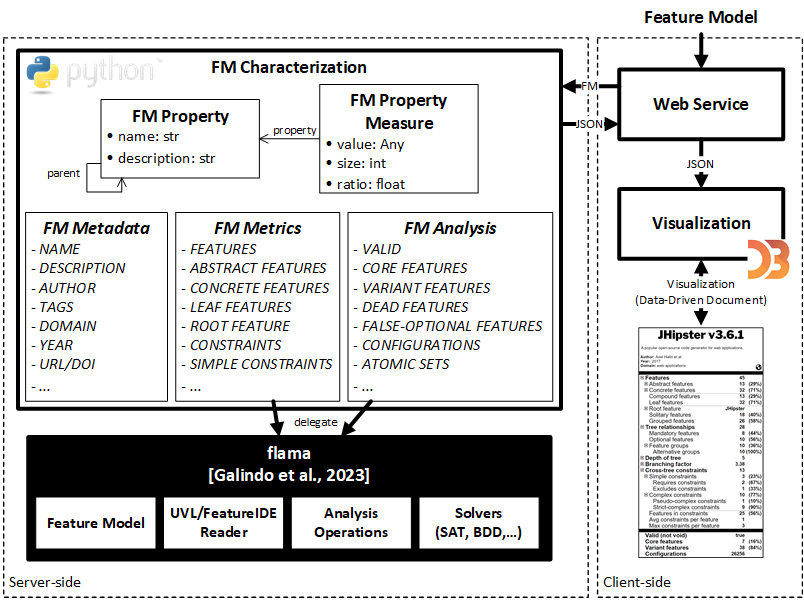

# Table of Contents
- [Table of Contents](#table-of-contents)
- [FM Fact Label: A Configurable and Interactive Visualization of Feature Model Characterizations](#fm-fact-label-a-configurable-and-interactive-visualization-of-feature-model-characterizations)
  - [Available online](#available-online)
  - [Artifact description](#artifact-description)
  - [How to use it](#how-to-use-it)
  - [Deployment of the web application locally](#deployment-of-the-web-application-locally)
    - [Requirements](#requirements)
    - [Download and install](#download-and-install)
    - [Execution](#execution)
  - [Video](#video)
  - [Architecture and repository's structure and contents](#architecture-and-repositorys-structure-and-contents)
    - [Software architecture](#software-architecture)
    - [Repository's structure and contents](#repositorys-structure-and-contents)
  - [References and third-party software](#references-and-third-party-software)

# FM Fact Label: A Configurable and Interactive Visualization of Feature Model Characterizations
A tool to generate visualizations of feature model characterizations as a fact label similar to the [nutritions fact label](https://en.wikipedia.org/wiki/Nutrition_facts_label).

## Available online
- [FM Fact Label](https://fmfactlabel.adabyron.uma.es/)

## Artifact description
*FM Fact Label* is an online web-based application that builds an FM characterization and generates its visualization as a fact label.

It offers a web service providing an online form to upload the FM and its metadata. Currently, UVL and FeatureIDE formats are supported.
At this date, the FM characterization provides up to 46 measures, including metrics and analysis results, and it is open to extension with further metrics from the SPL literature.
The fact label visualization is automatically generated using [D3](https://d3js.org/). D3 relies on web standards (HTML, CSS, JavaScript, SVG, and JSON) to combine visualization components and a data-driven approach that allows binding arbitrary data to a Document Object Model (DOM), and then applying data-driven transformations to the DOM. The tool benefits from D3 to provide an interactive and configurable visualization of the FM characterization.

## How to use it
The tool is currently deployed and available online in the following link: 

https://fmfactlabel.adabyron.uma.es/

The main use case of the tool is uploading an FM and automatically generates a visualization of its characterization which can be customized and exported. The use case can be described with the following steps:
- Upload an FM and provide metadata.
- Build the FM characterization and generate the FM fact label.
- Interact with the FM fact label.
- Customize the FM fact label.
- Export the FM fact label and the FM characterization.

<video width="320" height="240" controls>
  <source src="resources/video_demo.mp4" type="video/mp4">
</video>

## Deployment of the web application locally

### Requirements
- [Python 3.9+](https://www.python.org/)
- [Flask](https://flask.palletsprojects.com/en/3.0.x/)
- [Flamapy](https://www.flamapy.org/)
- [D3.js](https://d3js.org/)

### Download and install
1. Install [Python 3.9+](https://www.python.org/)
2. Clone this repository and enter into the main directory:

    `git clone https://github.com/jmhorcas/fm_characterization`

    `cd fm_characterization` 
3. Create a virtual environment: 
   
   `python -m venv env`
4. Activate the environment: 
   
   In Linux: `source env/bin/activate`

   In Windows: `.\env\Scripts\Activate`
   
5. Install the dependencies: 
   
   `pip install -r requirements.txt`

   

### Execution
To run the server locally execute the following command:

   `python  run.py`

Access to the web service in the localhost:

http://127.0.0.1:5000 or http://10.141.0.170:5000

## Video

https://user-images.githubusercontent.com/1789503/172726157-11ebe212-41f6-47a1-9ab7-ee378ed1aab7.mp4

## Architecture and repository's structure and contents
Here is a description of the architecture of the tool and the folders' structure and contents of this repository for those interesting in contributing to the project.

### Software architecture

The tool offers a web service to upload the feature model and its metadata via an online form (`Web Service` component). It supports feature models in UVL and FeatureIDE formats. The `FM Characterization` module in the server-side gathers and manages all the feature model information. We distinguish three kinds of information: metadata (`FM Metadata`), structural metrics (`FM Metrics`), and analysis results (`FM Analysis`), treating all of them as an `FM property`. Each `FM Property` includes a name, a description, and a parent property for hierarchical organization in the fact label. Properties are associated with an `FM Property Measure` that provides the specific values of the property. For instance, the list of abstract features, their size, and ratio for the `ABSTRACT FEATURES` property. Analysis tasks are delegated to external tools, with the current implementation relying on [flama](https://www.flamapy.org/) (dark component).

### Repository's structure and contents
- [run.py](run.py): It is the entry point of the application that consists on a [Flask](https://flask.palletsprojects.com/en/3.0.x/) server to expose the tool's functionality.
- [fm_characterization](fm_characterization/): Contains the code related to the server-side of the architecture in charge of gathering all the information of the feature model that is needed to build the fact label. Concretely, it contains the `FM Characterization`, `FM Metadata`, `FM Metrics`, `FM Analysis`, `FM property`, and `FM Property Measure` modules, among other utils. The dependency with the [flama](https://www.flamapy.org/) library is on the `FM Analysis` module.
- [web](web/): Contains the code related with the client-side of the architecture in charge of building the visualization of the fact label from the JSON information provided by the server-side. Concretely, it contains the HTML, CSS, and JavaScript files, where the most important is the [fm_fact_label.js](web/js/fm_fact_label/fm_fact_label.js) script which contains the main code in [D3.js](https://d3js.org/) to build the visualization of the fact label. Also, the [fm_models](web/fm_models) contains the feature models examples availables in the tool.
- [resources](resources/): Contains the images and videos used in this README.md file.

## References and third-party software
- [D3: Data-Driven Documents](https://d3js.org/)
- [Flama](https://www.flamapy.org/)
- [Flask](https://flask.palletsprojects.com/en/3.0.x/)
